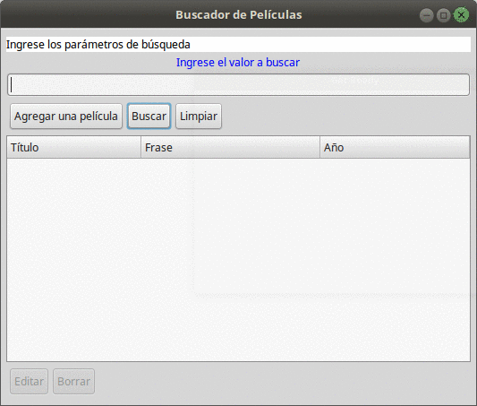
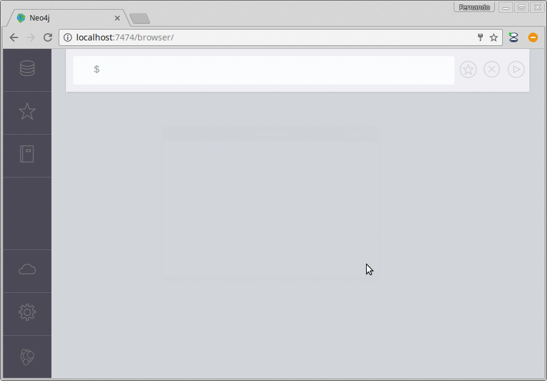

# Películas - Proyecto Xtend contra una base Neo4J

## Objetivo
Mostrar la integración entre una app hecha en JDK y Neo4J.

Toma la base de películas de ejemplo que viene con Neo4J y permite 

* generar una película nueva
* buscar películas existentes y editarlas
* agregar personajes
* a futuro, permitirá la actualización de actores

## Modelo Neo4J
Existen nodos Movie (Película) y Person (que representan cada Actor), que tienen una relación
ACTED_IN con atributos roles que terminan trasladándose al modelo de objetos como una clase Personaje.

## Cómo ejecutar el ejemplo

* Instalar la última versión de Neo4j en https://neo4j.com/download/
* Ir a la carpeta bin del directorio de instalación de Neo4J. Levantar el server: 

```
$ ./neo4j start
```

* Abrir un Navegador e ingresar como URL: http://localhost:7474
* Ejecutar el script que carga el grafo de películas


* Bajar el servicio neo4j. Desde la carpeta bin hacer

```
$ ./neo4j stop
```

* En el Eclipse, ingresar al archivo GraphDatabaseProvider y verificar que el PATH esté apuntando al directorio correcto

``` Xtend
static String PATH = "/home/fernando/apps/neo4j-community-3.0.4/data/databases"
```

* Botón derecho sobre el archivo "Peliculas Neo4J.launch" y Run, si respetaste el nombre del proyecto: eg-peliculas-neo4j



Las modificaciones que hagas impactarán en el grafo de películas (podés hacer consultas luego).




## Troubleshooting

* Si al arrancar la aplicación ves un mensaje de error como éste

```
Caused by: org.neo4j.kernel.StoreLockException: Store and its lock file has been locked by another process: /home/fernando/apps/neo4j-community-3.0.4/data/databases/graph.db/store_lock. Please ensure no other process is using this database, and that the directory is writable (required even for read-only access)
	at org.neo4j.kernel.internal.StoreLocker.storeLockException(StoreLocker.java:90)
	at org.neo4j.kernel.internal.StoreLocker.checkLock(StoreLocker.java:76)
```

Es que tenés que detener el servicio Neo4J, que en su versión Community no permite acceso por más de una aplicación a la vez.

* Si no ves ninguna película al comenzar la aplicación, revisá el PATH adonde está apuntando la base de grafos de películas

"# bvno4j" 
"# bvno4j" 
"# bvno4j" 
"# bvno4j" 
